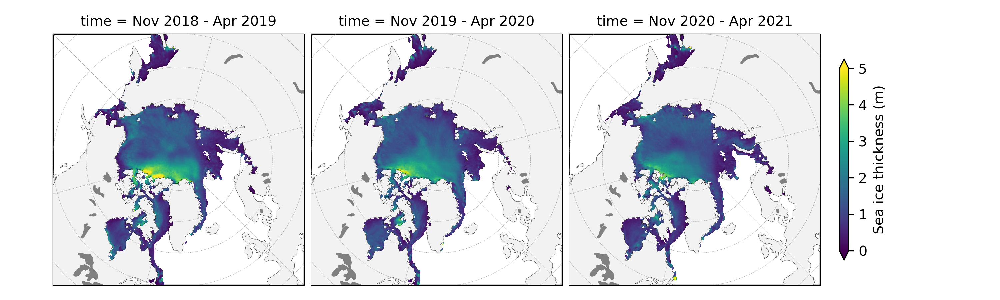

<!-- #region -->
ICESat-2 Sea Ice Thickness Data Analysis and Visualization
=============================================




# Contact 
**Nicole Keeney (Primary author)**<br>
nicolejkeeney@gmail.com<br>
GitHub: nicolejkeeney<br>

**Alek Petty (Supervisor, ICESat-2 sea ice data lead)**<br>
alek.a.petty@nasa.gov<br>
GitHub: akpetty<br>

# Introduction

NASA's Ice, Cloud, and Land Elevation Satellite-2 (ICESat-2) is a new satellite laser altimetry mission providing high resolution elevation profiling of the entire Earth's surface, particularly in the fast-changing Polar Regions. The ICESat-2 Project Office has produced and disseminated a number of official datasets including polar (Arctic and Antarctic) sea ice freeboard, the extension of sea ice above the local sea surface, in the official ATL10 product (https://nsidc.org/data/ATL10). Using assumptions regarding the snow depth and density on top of the ice, along with the density of the sea ice itself, freeboard measurements can be converted to estimates of sea ice thickness. Sea ice thickness estimates produced using snow loading from the NASA Eulerian Snow on Sea Ice Model (NESOSIM, https://github.com/akpetty/NESOSIM) have been made produced and available through the National Snow and Ice Data Center (NSIDC) (https://nsidc.org/data/IS2SITMOGR4). More information about the methodology behind this dataset can be found in the original paper [(http://www.alekpetty.com/papers/petty2020)](http://www.alekpetty.com/papers/petty2020). A new manuscript is in preparation describing the data presented in this book.

Since its launch in 2018, ICESat-2 has collected and released data over three (at the time of writing) winter seasons across the entire Arctic Ocean, which we describe and analyze within this Jupyter Book. <br><br> For more information on ICESat-2, see the project homepage: [https://icesat-2.gsfc.nasa.gov/](https://icesat-2.gsfc.nasa.gov/).

# Jupyter Book description
[Jupyter Books](https://jupyterbook.org/intro.html) provide a novel means of compiling Jupyter Notebooks into one convenient and well-indexed location. Here, jupyter notebooks are used to provide a visual demonstration of our efforts to analyze the monthly gridded ICESat-2 winter Arctic sea ice data (freeboard and thickness), along with other relevant datasets to help us understand recent winter Arctic sea ice growth.<br><br>We've also set up the book so that users can easily run the code without needing to download anything by using a hosting service called Binder. To run a notebook (chapter pages in the book) in Binder, just click the **Binder** tab under the rocket ship icon at the top of each notebook. This option is configured for all notebooks except the modules in the Helper Functions section and the data wrangling notebook. 

# Accessing the data 

The gridded ICESat-2 winter Arctic sea ice thickness data is available at the NSIDC (https://nsidc.org/data/IS2SITMOGR4), however to simply our analysis we have also uploaded these same data to a [google cloud storage bucket](https://console.cloud.google.com/storage/browser/sea-ice-thickness-data). We have also generated and uploaded a single netcdf file containing all the data presented in this Jupyter Book in the same bucket under the name `icesat2-book-data.nc`. This datasets contains all the gridded ICESat-2 sea ice thickness data along with all other datasets used in the notebook to help contextualize the sea ice and atmospheric conditions through each winter. All datasets included have been regridded to the same NSIDC North Polar Sterographic grid (the native grid of the ICESat-2 sea ice data used), to simplify the mapping and comparisons. See the data wrangling page for more information each dataset and on on the regridding process.<br><br> 

# Update history  
If you find any typos or errors in the code or have any suggestions for the book, feel free to open an issue, which you can find by mousing over the GitHub icon at the top of each page. If you are familiar with GitHub, you can also fork the book's repository and suggest an edit that way. 
 - 9/4/2020: Version 1
 - 11/18/2020: Updated with version 2 ICESat-2 data product for [AGU Fall 2020 poster highlighting the book](https://agu.confex.com/agu/fm20/meetingapp.cgi/Paper/684153). 
 - 6/14/2021: Transitioned from Google Colab interactivity to Binder. 
 - 10/25/2021: Added interactive plotting using hvplot. Improved interpolation/smoothing method for ICESat-2 data and added notebook to demonstrate steps. 
 - 12/15/2021: Updated notebooks to reflect new data variables in ICESat-2 data v2. Added drift vectors. 
 
# A note on xarray 
All of the notebooks in this notebook utilize [xarray](http://xarray.pydata.org/en/stable/), a python package built for working with multi-dimensional data like the monthly gridded sea ice data. Xarray is especially useful for time series data and allows for easily plotting data on map projections via compatability with the python packages cartopy and hvplot. 
<!-- #endregion -->

```python

```
